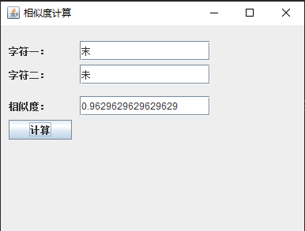

# 项目简介

[nlp-hanzi-similar](https://github.com/houbb/nlp-hanzi-similar) 为汉字提供相似性的计算。

[](http://mvnrepository.com/artifact/com.github.houbb/nlp-hanzi-similar)
[](https://www.travis-ci.org/houbb/nlp-hanzi-similar?branch=master)
[](https://coveralls.io/github/houbb/nlp-hanzi-similar?branch=master)

## 创作目的

有一个小伙伴说自己在做语言认知科学方向的课题研究，看了我以前写的 [NLP 中文形近字相似度计算思路](https://houbb.github.io/2020/01/20/nlp-chinese-similar-char)

就想问下有没有源码或者相关资料。

国内对于文本的相似度计算，开源的工具是比较丰富的。

但是对于两个汉字之间的相似度计算，国内基本一片空白。国内的参考的资料少的可怜，国外相关文档也是如此。

于是将以前写的相似度算法整理开源，希望能帮到这位小伙伴。

本项目旨在抛砖引玉，实现一个基本的相似度计算工具，为汉字 NLP 贡献一点绵薄之力。

推荐阅读：

[NLP 中文形近字相似度计算思路](https://mp.weixin.qq.com/s/i3h_15kYRb89MsApZ5nwPQ)

[中文形近字相似度算法实现，为汉字 NLP 尽一点绵薄之力](https://mp.weixin.qq.com/s/pDt3R04-XWKSvo1hJpTSDg)

[当代中国最贵的汉字是什么？](https://mp.weixin.qq.com/s/SETYeJchvWuqicrHLgG2mQ)

## 特性

- fluent 方法，一行代码搞定一切

- 高度自定义，允许用户定义自己的实现

- 词库自定义，适应各种应用场景

- 丰富的实现策略

默认实现了基于 四角编码+拼音+汉字结构+汉字偏旁+笔画数+拆字 的相似度比较。

# 变更日志

> [变更日志](CHANGELOG.md)

# 快速开始 

## 需要 

jdk1.7+

maven 3.x+

## maven 引入 

```xml
<dependency>
    <groupId>com.github.houbb</groupId>
    <artifactId>nlp-hanzi-similar</artifactId>
    <version>1.2.0</version>
</dependency>
```

## 快速开始

### 基本用法

`HanziSimilarHelper.similar` 获取两个汉字的相似度。

```java
double rate1 = HanziSimilarHelper.similar('末', '未');
```

结果为：

```
0.9629629629629629
```

### 自定义权重

默认是根据 四角编码+拼音+汉字结构+汉字偏旁+笔画数 进行相似度比较。

如果默认的系统权重无法满足你的需求，你可以通过自定义权重调整：

```java
double rate = HanziSimilarBs.newInstance()
                .jiegouRate(10)
                .sijiaoRate(8)
                .bushouRate(6)
                .bihuashuRate(2)
                .pinyinRate(1)
                .chaiziRate(8)    
                .similar('末', '未');
```

### 自定义相似度

有些情况下，系统的计算是无法满足的。

用户可以在根目录下 `hanzi_similar_define.txt` 进行自定义。

```
入人 0.9
人入 0.9
```

这样在计算 `人` 和 `入` 的相似度时，会优先以用户自定义的为准。

```java
double rate = HanziSimilarHelper.similar('人', '入');
```

此时的结果为用户自定义的值。

# 引导类

## 说明 

为了便于用户自定义，`HanziSimilarBs` 支持用户进行自定义配。

HanziSimilarBs 中允许自定义的配置列表如下：

| 序号 | 属性 | 说明 |
|:---|:---|:---|
| 1 | bihuashuRate | 笔画数权重 |
| 2 | bihuashuData | 笔画数数据 |
| 3 | bihuashuSimilar | 笔画数相似度策略 |
| 4 | jiegouRate | 结构权重 |
| 5 | jiegouData | 结构数据 |
| 6 | jiegouSimilar | 结构相似度策略 |
| 7 | bushouRate | 部首权重 |
| 8 | bushouData | 部首数据 |
| 9 | bushouSimilar | 部首相似度策略 |
| 10 | sijiaoRate | 四角编码权重 |
| 12 | sijiaoData | 四角编码数据 |
| 13 | sijiaoSimilar | 四角编码相似度策略 |
| 14 | pinyinData | 拼音数据 |
| 15 | pinyinSimilar | 拼音相似度策略 |
| 16 | hanziSimilar | 汉字相似度核心策略 |
| 17 | userDefineData | 用户自定义数据 |
| 18 | chaiziRate | 拆字比例 |
| 19 | chaiziSimlar | 拆字相似度 |

所有的配置都可以基于接口，用户进行自定义。

# python 版本

## 说明

NLP 的很多小伙伴都是 python 语言的使用者。

为了便于大家学习，提供了 python 的简易版本实现，可以自行修改。

> [python 版本](https://github.com/houbb/nlp-hanzi-similar/releases/tag/pythn)

## 实现

```python
#!/usr/bin/env python3
# -*- coding: utf-8 -*-

'''
desc: 初始化字典
author: 老马啸西风
date: 2021-11-24
'''
def initDict(path):
   dict = {}; 
   with open(path, 'r', encoding='utf-8', errors='ignore') as f:
        for line in f.readlines():
            # 移除换行符，并且根据空格拆分
            splits = line.strip('\n').split(' ');
            key = splits[0];
            value = splits[1];
            dict[key] = value; 
   return dict;
   
# 字典初始化 
bihuashuDict = initDict('./db/bihuashu_2w.txt');
hanzijiegouDict = initDict('./db/hanzijiegou_2w.txt');
pianpangbushouDict = initDict('./db/pianpangbushou_2w.txt');
sijiaobianmaDict = initDict('./db/sijiaobianma_2w.txt');

# 权重定义（可自行调整）
hanzijiegouRate = 10;
sijiaobianmaRate = 8;
pianpangbushouRate = 6;
bihuashuRate = 2;

# 计算核心方法
'''
desc: 笔画数相似度
'''
def bihuashuSimilar(charOne, charTwo): 
    valueOne = bihuashuDict[charOne];
    valueTwo = bihuashuDict[charTwo];
    
    numOne = int(valueOne);
    numTwo = int(valueTwo);
    
    diffVal = 1 - abs((numOne - numTwo) / max(numOne, numTwo));
    return bihuashuRate * diffVal * 1.0;

    
'''
desc: 汉字结构数相似度
'''
def hanzijiegouSimilar(charOne, charTwo): 
    valueOne = hanzijiegouDict[charOne];
    valueTwo = hanzijiegouDict[charTwo];
    
    if valueOne == valueTwo:
        # 后续可以优化为相近的结构
        return hanzijiegouRate * 1;
    return 0;
    
'''
desc: 四角编码相似度
'''
def sijiaobianmaSimilar(charOne, charTwo): 
    valueOne = sijiaobianmaDict[charOne];
    valueTwo = sijiaobianmaDict[charTwo];
    
    totalScore = 0.0;
    minLen = min(len(valueOne), len(valueTwo));
    
    for i in range(minLen):
        if valueOne[i] == valueTwo[i]:
            totalScore += 1.0;
    
    totalScore = totalScore / minLen * 1.0;
    return totalScore * sijiaobianmaRate;

'''
desc: 偏旁部首相似度
'''
def pianpangbushoutSimilar(charOne, charTwo): 
    valueOne = pianpangbushouDict[charOne];
    valueTwo = pianpangbushouDict[charTwo];
    
    if valueOne == valueTwo:
        # 后续可以优化为字的拆分
        return pianpangbushouRate * 1;
    return 0;  
    
'''
desc: 计算两个汉字的相似度
'''
def similar(charOne, charTwo):
    if charOne == charTwo:
        return 1.0;
    
    sijiaoScore = sijiaobianmaSimilar(charOne, charTwo);    
    jiegouScore = hanzijiegouSimilar(charOne, charTwo);
    bushouScore = pianpangbushoutSimilar(charOne, charTwo);
    bihuashuScore = bihuashuSimilar(charOne, charTwo);
    
    totalScore = sijiaoScore + jiegouScore + bushouScore + bihuashuScore;    
    totalRate = hanzijiegouRate + sijiaobianmaRate + pianpangbushouRate + bihuashuRate;
    
    
    result = totalScore*1.0 / totalRate * 1.0;
    print('总分：' + str(totalScore) + ', 总权重: ' + str(totalRate) +', 结果:' + str(result));
    print('四角编码：' + str(sijiaoScore));
    print('汉字结构：' + str(jiegouScore));
    print('偏旁部首：' + str(bushouScore));
    print('笔画数：' + str(bihuashuScore));
    return result;

# 这里 末 未 相似度为1，因为没有拼音的差异。四角编码一致。
# 可以手动替换下面的字，或者读取文件，循环计算
'''
$ python main.py
总分：25.428571428571427, 总权重: 26, 结果:0.978021978021978
四角编码：8.0
汉字结构：10
偏旁部首：6
笔画数：1.4285714285714286
'''

similar('末', '来')
``` 

# 快速体验

## 说明

如果 java 语言不是你的主要开发语言，你可以通过下面的 exe 文件快速体验一下。

## 下载地址

> [https://github.com/houbb/nlp-hanzi-similar/releases/download/exe/hanzi-similar.zip](https://github.com/houbb/nlp-hanzi-similar/releases/download/exe/hanzi-similar.zip)

下载后直接解压得到 `hanzi-similar.exe` 免安装的可执行文件。

## 执行效果

界面是使用 java swing 实现的，所以美观什么的，已经完全放弃治疗 T_T。

使用 exe4j 打包。

字符一输入一个汉字，字符二输入另一个汉字，点击计算，则可以获取对应的相似度。



# 字典的弊端

这个项目开源，是因为有一位小伙伴有相关的需求，但是他不懂 java。

一开始想把项目设计成为字典的形式，两个字对应一个相似度。

但是有一个问题，2W 汉字，和 2W 汉字的相似度字典，数量已经是近亿的数据量。

空间复杂度过高，同时会导致时间复杂度问题。

所以目前采用的是实时计算，有时间做一下其他语言的迁移 :) 

# 实现原理

## 实现思路

不同于文本相似度，汉字相似度的单位是汉字。

所以相似度是对于汉字的拆解，比如笔画，拼音，部首，结构等。

推荐阅读：

> [NLP 中文形近字相似度计算思路](https://houbb.github.io/2020/01/20/nlp-chinese-similar-char)

计算思路描述了实现的原理，但是小伙伴反应不会实现，于是才有了本项目。

## 核心代码

核心实现如下，就是各种相似度，进行加权计算。

```java
/**
 * 相似度
 *
 * @param context 上下文
 * @return 结果
 * @since 1.0.0
 */
@Override
public double similar(final IHanziSimilarContext context) {
    final String charOne = context.charOne();
    final String charTwo = context.charTwo();

    //1. 是否相同
    if(charOne.equals(charTwo)) {
        return 1.0;
    }

    //2. 是否用户自定义
    Map<String, Double> defineMap = context.userDefineData().dataMap();
    String defineKey = charOne+charTwo;
    if(defineMap.containsKey(defineKey)) {
        return defineMap.get(defineKey);
    }

    //3. 通过权重计算获取
    //3.1 四角编码
    IHanziSimilar sijiaoSimilar = context.sijiaoSimilar();
    double sijiaoScore = sijiaoSimilar.similar(context);

    //3.2 结构
    IHanziSimilar jiegouSimilar = context.jiegouSimilar();
    double jiegouScore = jiegouSimilar.similar(context);

    //3.3 部首
    IHanziSimilar bushouSimilar = context.bushouSimilar();
    double bushouScore = bushouSimilar.similar(context);

    //3.4 笔画
    IHanziSimilar biahuashuSimilar = context.bihuashuSimilar();
    double bihuashuScore = biahuashuSimilar.similar(context);

    //3.5 拼音
    IHanziSimilar pinyinSimilar = context.pinyinSimilar();
    double pinyinScore = pinyinSimilar.similar(context);

    //4. 计算总分
    double totalScore = sijiaoScore + jiegouScore + bushouScore + bihuashuScore + pinyinScore;
    //4.1 避免浮点数比较问题
    if(totalScore <= 0) {
        return 0;
    }

    //4.2 正则化
    double limitScore = context.sijiaoRate() + context.jiegouRate()
            + context.bushouRate() + context.bihuashuRate() + context.pinyinRate();

    return totalScore / limitScore;
}
```

具体的细节，如果感兴趣，可以自行阅读源码。

## 开源地址

为了便于大家的学习和使用，本项目已开源。

开源地址：

> [https://github.com/houbb/nlp-hanzi-similar](https://github.com/houbb/nlp-hanzi-similar)

欢迎大家，fork&star 鼓励一下老马~

# 算法的优缺点

## 优点

为数不多的几篇 paper 是从汉字的结构入手的。

本算法引入了四角编码+结构+部首+笔画+拼音的方式，使其更加符合国内的使用直觉。

## 缺点

部首这部分因为当时数据问题，实际上是有缺憾的。

后续准备引入拆字字典，对汉字的所有组成部分进行对比，而不是目前一个简单的部首。

# NLP 开源矩阵

[pinyin 汉字转拼音](https://github.com/houbb/pinyin)

[pinyin2hanzi 拼音转汉字](https://github.com/houbb/pinyin2hanzi)

[segment 高性能中文分词](https://github.com/houbb/segment)

[opencc4j 中文繁简体转换](https://github.com/houbb/opencc4j)

[nlp-hanzi-similar 汉字相似度](https://github.com/houbb/nlp-hanzi-similar)

[word-checker 拼写检测](https://github.com/houbb/word-checker)

[sensitive-word 敏感词](https://github.com/houbb/sensitive-word)

# 后期 Road-MAP

- [ ] 丰富相似度策略

- [ ] 优化默认权重 

- [ ] 优化 exe 界面
